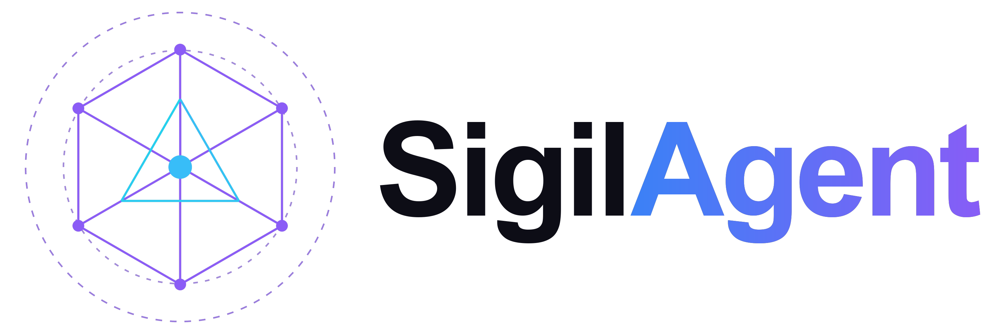
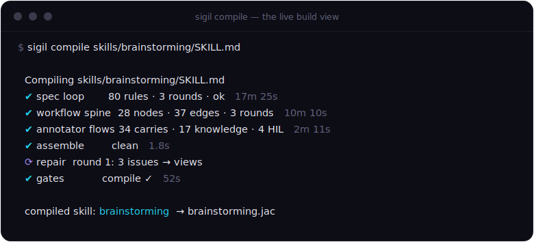
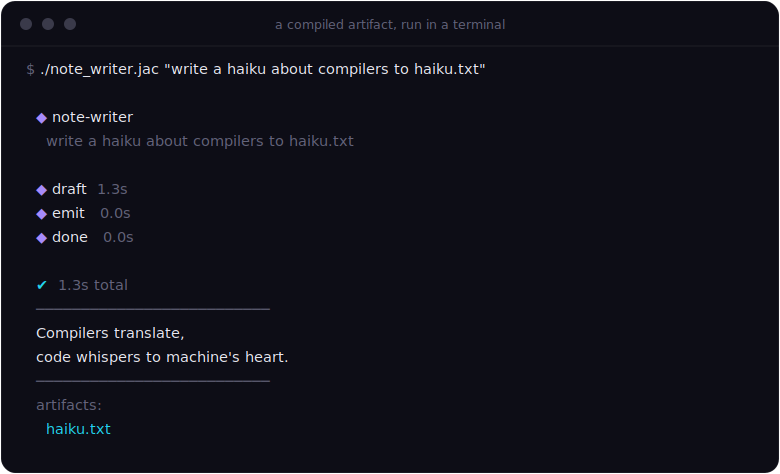
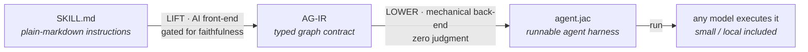
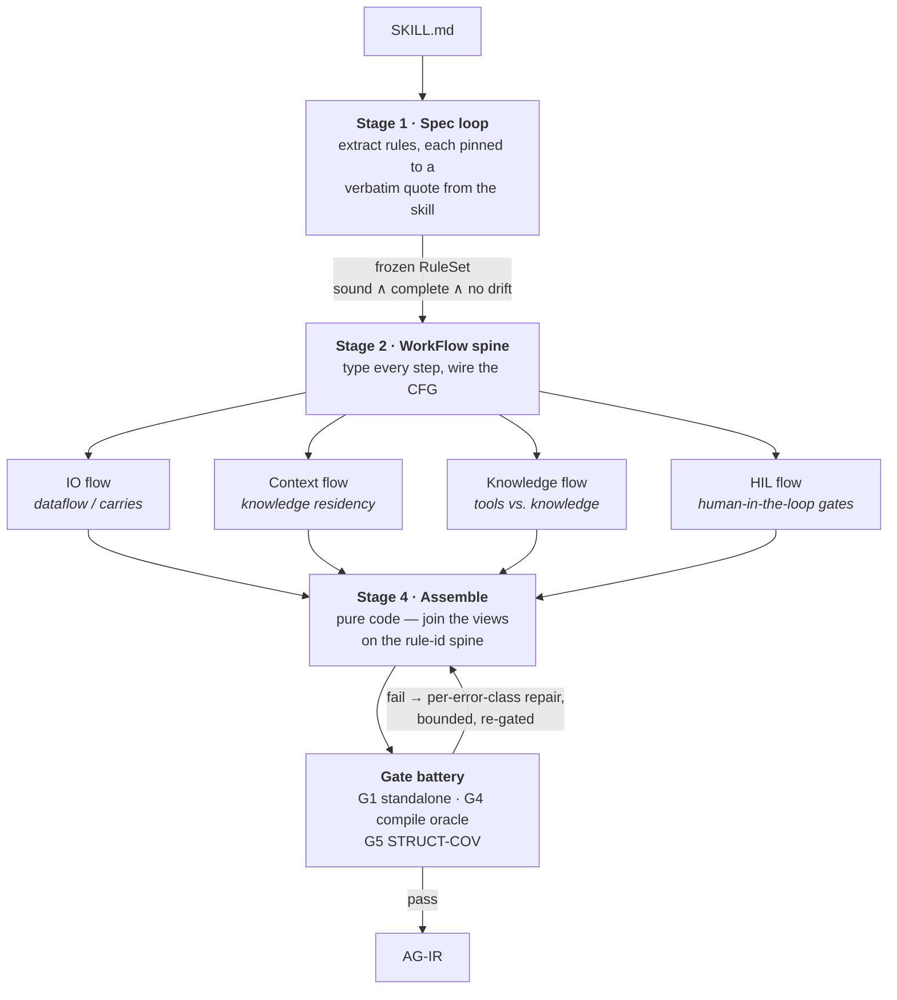
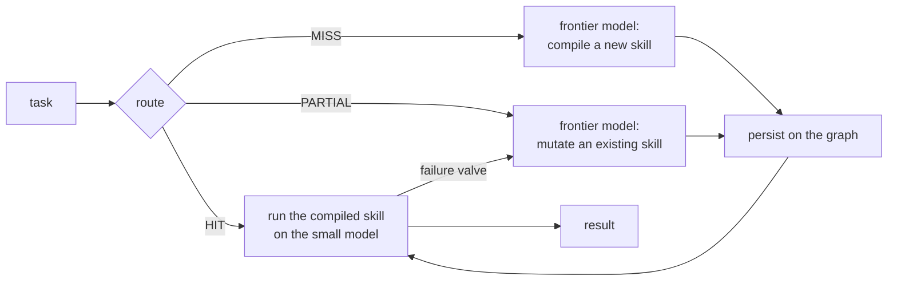
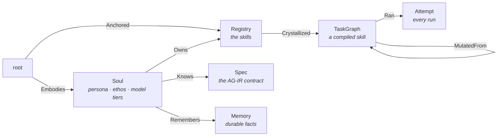

<div align="center">
  <picture>
    <source media="(prefers-color-scheme: dark)" srcset="docs/assets/logo-lockup.png">
    
  </picture>
  <p><strong>The skill compiler — <code>SKILL.md</code> in, a typed agent harness out.</strong></p>
  <p>
    <a href="https://github.com/sigilagent/sigil/actions/workflows/ci.yml"></a>
    <a href="https://github.com/sigilagent/sigil/releases/latest"></a>
    <a href="https://github.com/sigilagent/sigil/releases"></a>
    <a href="LICENSE"></a>
    <a href="https://sigilagent.com"></a>
    <a href="https://sigilagent.com/reference/"></a>
    <a href="https://doi.org/10.5281/zenodo.21499104"></a>
  </p>
  <p>
    <a href="https://www.jaseci.org/"> &nbsp;<b>built with Jac</b></a>
  </p>
</div>

**Sigil compiles skills into agent harnesses.** You write a skill the way you
already do — a plain-markdown `SKILL.md`. Sigil's compiler turns it into a
typed, runnable program that the model executes *inside*: every step, rule and
check in the skill becomes structure the model cannot skip.

```bash
sigil compile ./SKILL.md -e agent.jac    # SKILL.md  →  one runnable agent
./agent.jac "extract the tables from report.pdf"
SIGIL_MODEL=ollama_chat/qwen3:8b ./agent.jac "..."   # any model can run it
```

<table align="center"><tr>
<td width="50%"></td>
<td width="50%"></td>
</tr><tr>
<td align="center"><sub><b>Compiling</b> is a live build view — every stage, with counts and timing.</sub></td>
<td align="center"><sub><b>Running</b> a compiled skill is a terminal app — node-by-node, with its output.</sub></td>
</tr></table>

## Why compile a skill?

In every agent harness today, a skill is a **prompt**. The model *reads* the
instructions and you *hope* it follows them. A frontier model mostly does; a
small model skips steps, ignores MUSTs, invents its own order, and forgets the
verification you asked for. The skill's quality is capped by the model's
obedience.

Sigil treats the skill as **source code**. The compiler reads `SKILL.md` and
emits a program in which:

- every mandatory step is a **node the execution must visit**, in the skill's
  order — step order is control flow, not a suggestion;
- every prohibition becomes a **constraint on a node**, never a path the run
  can take;
- code snippets in the skill are **embodied as runnable tool bodies** — the
  agent runs the skill's prescribed code, it can't paraphrase it;
- verification steps become **gates in the program**, with typed verdicts;
- the model's judgment is confined to **typed slots** (`by llm`) at exactly the
  points where the skill calls for judgment.

The model isn't asked to *be* disciplined — the harness is the discipline. That
is why a compiled skill runs faithfully on a small, cheap, even fully-local
model: the structure a weak model would skip is no longer skippable.



## The architecture — a classic two-half compiler

The pipeline splits exactly where a traditional compiler does: a **front-end**
that owns all the judgment, and a **back-end** that owns none.

```
src/compiler/
  ai/            LIFT — authors the AG-IR from SKILL.md, under a faithfulness constraint
  mechanical/    LOWER — deterministically transpiles AG-IR → Jac (OSP) source
src/contracts/   the AG-IR standard: primitives, authoring contract, lowering rules
```

### The IR in the middle: AG-IR

The AG-IR (Agent Graph IR) is the analyzable middle between fuzzy prose and an
executable agent — **one typed graph read four ways**: the step flowchart, the
control-flow graph, the dataflow of typed *carries*, and the knowledge/tool
residency map. Its primitives are small and closed:

| family | primitives | owner |
|---|---|---|
| Mind (cognition) | `GEN-RAW` · `GEN-FILL` · `GEN-ENUM` · `GEN-EDIT` | model |
| Boundary & Code (mechanism) | `SENSE` · `ACT·artifact` · `ACT·workspace` · `CODE` | code |
| Flow (control) | `ROUTE` · `LOOP` · `CALL` · `SPAWN` | either |

Every primitive has a fixed set of settable fields and **exactly one lowering**
— that closed contract is what makes the back-end deterministic. The full
standard lives in [`src/contracts/`](src/contracts/).

### LIFT — the AI front-end, structured so it cannot drift

Extracting a typed contract from prose takes model judgment. LIFT is built so
that judgment can never silently corrupt the skill — the operating principle
throughout is **the model proposes, code disposes**:



- **The Spec loop** ([`spec_loop.jac`](src/compiler/ai/spec_loop.jac)) is the
  anchor. A model extracts candidate rules, but a **deterministic grounding
  check** drops any rule whose quote is not verbatim in the skill — a
  hallucinated rule cannot produce a matching span, so the loop can never
  declare victory over an ungrounded spec. Three coverage critics hunt for
  dropped obligations (self-filtered by the same grounding check), and a code
  audit catches modality drift — e.g. a conditional quietly inflated into an
  unconditional MUST. The loop exits only when the spec is sound ∧ complete ∧
  drift-free; the frozen RuleSet is what every later stage is audited against.
- **The spine and the four flows** type every step against that RuleSet and
  annotate it from four angles. The flows are read-shared / write-isolated, so
  they fan out **concurrently** — using the same `flow`/`wait` mechanism the
  compiler itself emits for `SPAWN` nodes.
- **The gates** ([`gates.jac`](src/compiler/ai/gates.jac)) are typed verdicts
  that must be routed — never a silent success. **G4, the compile oracle**,
  round-trips every candidate IR through the mechanical back-end and the `jac`
  type-checker: a deterministic ground truth a hand-lifted skill never has.
  **G5 STRUCT-COV** checks the *compiled module* realizes every mandate.
- **Repair** is per-error-class and bounded: view-level issues route back to
  the flow that owns the view; compile failures drive a scoped fix-only-this
  edit loop. Exhaustion returns an honest failure with its errors attached.

A gate failure **raises** — Sigil refuses to persist an unfaithful skill.

### LOWER — the mechanical back-end

[`mechanical/compiler.jac`](src/compiler/mechanical/compiler.jac) transpiles
the AG-IR *as written* into a Jac **object-spatial program** — nodes, edges,
and a walker that traverses them. Every IR construct has one Jac form; if
lowering ever needs a judgment call, the IR was underspecified and the
*front-end* is at fault. Some of the load-bearing lowerings:

- a `GEN-*` node becomes a typed `by llm` slot: its `reads` are typed
  parameters, its knowledge residents ride the `sem` prompt, its `writes` are
  assigned — the model fills a slot, it doesn't improvise a step;
- a model-owned `ROUTE` lowers to LLM-guided graph traversal
  (`visit [-->] by llm(...)`) — the model picks the branch, the graph defines
  the branches;
- tool snippets are synthesized **runnable** (inline Python, subprocess'd
  shell, `node` for JS…), wrapped param-driven — never pasted as prose;
- `SPAWN` fans sub-agents out via Jac's `flow`/`wait` concurrency;
- `FORBIDDEN` rules become node constraints — there is no edge to lower them
  to, by design.

### Eject — one file, no harness needed

The generated module embeds its full runtime helper library, so `-e` packaging
is just a `jac run` shebang plus a CLI shim:

```bash
sigil compile ./SKILL.md                 # compile onto Sigil's graph
sigil compile ./SKILL.md -e agent.jac    # …and eject ONE self-contained runnable
./agent.jac "run the skill"              # no sigil, no session, no graph needed
```

The AG-IR provenance stays on Sigil's graph; the runnable carries none of it.

### Replay — recorded runs as free regression tests

Sigil's observability log records every LLM call's wire content. `replay`
re-executes a recorded run's cognition through a (re)compiled module — no
model, no cost, no nondeterminism. Change the compiler, replay the corpus:
any expensive live failure becomes a permanent free test case.

## The runtime around the compiler

The compiler is the core; Sigil also ships a persistent agent built on it. The
agent **is an object-spatial graph**: its skills are compiled `TaskGraph`s, its
memory and config are nodes, and `solve` routes every task through them.



The expensive model is paid **once per class of task** — to compile the
harness. The cheap model rides it forever; on a miss or a failure the frontier
compiles or mutates, and the new version persists.



Three memory layers, all graph-native: **procedural** (the compiled skills),
**episodic** (`Attempt` nodes — every run and its outcome), **semantic**
(`Memory` nodes — durable facts, injected at *execution* time, never baked
into the compiled procedure, which stays class-general).

Around that core, the usual agent surface — all driving the same graph:

- **Chat** — a conversational, tool-using ReAct agent (`sigil chat`): jailed
  workspace with an exec-approval gate, SSRF-guarded web tools, its own cron,
  parallel sub-agents, and `learn_skill` to compile a skill mid-conversation.
- **Skill ingress, three forms** — `register-skill ./SKILL.md` (the compiler),
  `./procedure.agir agir` (hand-authored IR, no model call), `./foo_v1.jac osp`
  (a precompiled module).
- **MCP** — `add-mcp` registers any stdio/SSE/HTTP tool server; the compiler
  binds those tool names when it compiles, and live runs dispatch to them.
- **Channels** — Discord / Telegram / WhatsApp / Slack ride one webhook
  contract (`POST /walker/api_inbound`).
- **Cron** — real `CronJob` nodes on the graph, schedulable from chat.
- **Observatory** — `sigil serve`: a live web UI over the graph with full
  token observability on every run.

Execution isolation: a compiled agent builds its own task-graph when it runs,
so Sigil runs each compiled module in a **separate subprocess** — the run's
throwaway graph never touches Sigil's own.

## Install & use

```bash
curl -fsSL https://github.com/sigilagent/sigil/releases/latest/download/install.sh | bash
```

```bash
sigil compile ./SKILL.md -e agent.jac        # the compiler, end to end
sigil solve "turn report.pdf into clean CSV" # the agent: compile on miss, reuse on hit
sigil solve "pull the tables out of invoice.pdf"   # HIT — runs the compiled skill
sigil library                                # the compiled skills, with run stats
sigil soul                                   # identity, config, skills & memory
sigil teach "always give me CSV with a header row"
```

Cognition is configured on the graph (or seeded from env on first boot):
`SIGIL_FRONTIER` (the compiler's model, default `gpt-5`), `SIGIL_SMALL` (the
execution model, default `ollama_chat/qwen3:32b`, can be fully local),
`SIGIL_ROUTER`. An ejected runnable picks its model from `SIGIL_MODEL`.

## Layout

```
main.jac                 CLI entrypoint (compile / solve / chat / serve / …)
observatory.jac          full-stack server entrypoint — API + web UI
src/
  compiler/              THE COMPILER
    ai/                    LIFT: spec_loop · workflow · flows · assemble · gates · repair · eject · replay
    mechanical/            LOWER: the AG-IR → OSP transpiler + runtime assets
  contracts/             the AG-IR standard (primitives · authoring contract)
  sigil.jac              graph model + routing + the compile/execute cognition
  chat_agent.jac         the conversational ReAct agent
  sigil_workspace.jac    sandbox: jailed file tools, gated exec, SSRF-guarded web
  agent.jac / channels.jac / cron.jac / hooks.jac / …   the runtime surface
web/                     the Observatory browser client
.jac/data/               (runtime) the persistent graph
```

Compiler deep-dive: [`src/compiler/README.md`](src/compiler/README.md). The
user reference lives in [`docs/reference/`](docs/reference/) — loaded at
runtime by the agent itself, so what you read is exactly what Sigil reads to
answer questions about itself.

## Status

The compiler is built and verified end to end: the gated LIFT converges on
MockLLM-driven tests, G4 round-trips real AG-IRs through the mechanical half
with a clean `jac check`, and ejected runnables execute standalone. The graph
runtime (routing, soul/memory/config lifecycle, chat, cron, channels,
Observatory) is built and tested; the live `solve` loop needs the configured
models (a frontier provider key + a small model, which can be local).

## Paper

The design and the evaluation behind Sigil are written up in
**[SIGIL: Compiling Agent Skills into Typed Harnesses](https://doi.org/10.5281/zenodo.21499104)**
— compiled skills execute 86% of mandated steps versus 56% for the same skill
read as a prompt, at 0.58× the tokens.

### Citation

If you use Sigil or the AG-IR in your work, please cite:

```bibtex
@misc{dantanarayana2026sigil,
  title     = {SIGIL: Compiling Agent Skills into Typed Harnesses},
  author    = {Dantanarayana, Jayanaka and Kashmira, Savini and Tang, Lingjia and Mars, Jason},
  year      = {2026},
  publisher = {Zenodo},
  doi       = {10.5281/zenodo.21499104},
  url       = {https://doi.org/10.5281/zenodo.21499104}
}
```

> Dantanarayana, J., Kashmira, S., Tang, L., & Mars, J. (2026). *SIGIL:
> Compiling agent skills into typed harnesses.* Zenodo.
> https://doi.org/10.5281/zenodo.21499104
