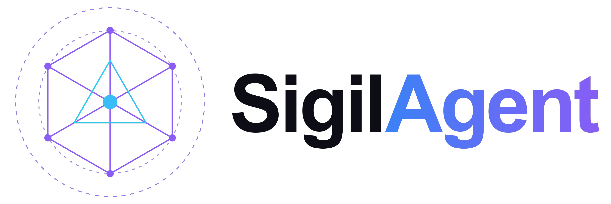
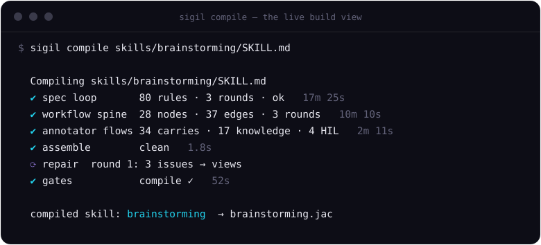
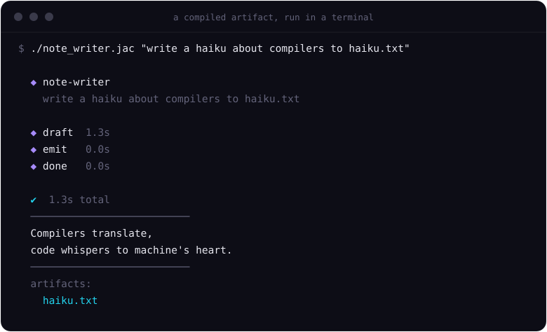
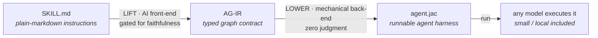

<div align="center">
  <picture>
    <source media="(prefers-color-scheme: dark)" srcset="docs/assets/logo-lockup.png">
    
  </picture>
  <p><strong>The skill compiler — <code>SKILL.md</code> in, a typed agent harness out.</strong></p>
  <p>
    <a href="https://github.com/sigilagent/sigil/actions/workflows/ci.yml"></a>
    <a href="https://github.com/sigilagent/sigil/releases/latest"></a>
    <a href="LICENSE"></a>
    <a href="https://sigilagent.com"></a>
    <a href="https://sigilagent.com/reference/"></a>
    <a href="https://arxiv.org/abs/2607.27309"></a>
  </p>
  <p>
    <a href="https://www.jaseci.org/"> &nbsp;<b>built with Jac</b></a>
  </p>
</div>

In every agent harness today, a skill is a prompt. The model reads the
instructions and you hope it follows them. A frontier model mostly does; a small
model skips steps, ignores MUSTs, and forgets the verification you asked for.

Sigil treats the skill as source code. You write the same plain-markdown
`SKILL.md` you already write, and the compiler turns it into a typed program the
model runs *inside*: mandatory steps become nodes the run must visit, in the
skill's order. Prohibitions become constraints with no edge to traverse. Code
snippets become runnable tool bodies. Verification steps become gates with typed
verdicts. The model's judgment is confined to typed slots at exactly the points
where the skill calls for judgment.

That is why a compiled skill runs faithfully on a small, cheap, even fully-local
model: the structure a weak model would skip is no longer skippable.

```bash
sigil compile ./SKILL.md -e agent.jac    # SKILL.md  →  one runnable agent
./agent.jac "extract the tables from report.pdf"
SIGIL_MODEL=ollama_chat/qwen3:8b ./agent.jac "..."   # any model can run it
```

<table align="center"><tr>
<td width="50%"></td>
<td width="50%"></td>
</tr><tr>
<td align="center"><sub><b>Compiling</b> is a live build view — every stage, with counts and timing.</sub></td>
<td align="center"><sub><b>Running</b> a compiled skill is a terminal app — node-by-node, with its output.</sub></td>
</tr></table>

## Install

```bash
curl -fsSL https://github.com/sigilagent/sigil/releases/latest/download/install.sh | bash
```

```bash
sigil compile ./SKILL.md -e agent.jac        # the compiler, end to end
sigil solve "turn report.pdf into clean CSV" # the agent: compile on miss, reuse on hit
sigil library                                # the compiled skills, with run stats
sigil chat                                   # the conversational agent over the same graph
```

Models are configured on the graph, seeded on first boot from `SIGIL_FRONTIER`
(the compiler's model, default `gpt-5`), `SIGIL_SMALL` (the execution model,
default `ollama_chat/qwen3:32b`, can be fully local), and `SIGIL_ROUTER`. An
ejected runnable picks its model from `SIGIL_MODEL`.

## Works with Claude Code — both directions

Sigil plugs into the harness you already use, and needs no API key to do it.
Compile on the `claude` CLI you already have, then serve every skill you compile
back into it as a tool.

```bash
sigil --claude compile ./SKILL.md          # compile on your Claude subscription
claude mcp add sigil -- sigil mcp-serve    # each compiled skill → a Claude Code tool
```

Claude Code decides *when*; the compiled harness decides *how*. A skill loaded
into context is advice the model may follow. Behind one of these tool calls
there is no prompt left to drift from.

byLLM dispatches through litellm, and litellm lets you own a provider prefix, so
a headless `claude -p` is just another model — typed returns and tool-using slots
included. Each compiled skill becomes one MCP tool, triggered by the skill's own
`description:` frontmatter and carrying its run record. When a compile fails its
gate, a tool-using session gets the workspace and the compile oracle as a command
(`sigil gate`) and iterates until it passes; the oracle stays the authority.

Details: [`docs/reference/claude-code.md`](docs/reference/claude-code.md).

## How the compiler works

The pipeline splits where a traditional compiler does: a front-end that owns all
the judgment, and a back-end that owns none.


```mermaid
flowchart LR
    SKILL["SKILL.md<br/><i>plain-markdown instructions</i>"]
    IR["AG-IR<br/><i>typed graph contract</i>"]
    JAC["agent.jac<br/><i>runnable agent harness</i>"]
    RUN["any model executes it<br/><i>small / local included</i>"]
    SKILL -- "LIFT · AI front-end<br/>gated for faithfulness" --> IR
    IR -- "LOWER · mechanical back-end<br/>zero judgment" --> JAC
    JAC -- run --> RUN
```

The AG-IR in the middle is one typed graph read four ways: the step flowchart,
the control-flow graph, the dataflow of typed carries, and the knowledge/tool
residency map. Its primitives are closed, and each has exactly one lowering —
that is what lets the back-end be deterministic.

LIFT's anchor is the spec loop: a model extracts candidate rules, and a
deterministic grounding check drops any rule whose quote is not verbatim in the
skill, so a hallucinated rule can never survive. Coverage critics hunt for
dropped obligations, and a code audit catches modality drift. Then the gates
check the result — G4, the compile oracle, round-trips every candidate IR through
the mechanical back-end and the `jac` type-checker. They diagnose rather than
veto: mechanical autofixes land first, scoped model repair second, faithful
degradation third, and whatever remains rides the result as typed findings. A
compile fails only when no runnable module exists at all, and `--strict` restores
fail-on-any-finding for CI.

Compiling interactively also offers to lint the skill first. Obligations the spec
loop found underspecified or self-contradictory come back as findings, and your
one do / maybe / don't answer both settles the obligation and writes the sentence
that encodes it durably into the `SKILL.md`. Standalone:
`sigil lint <SKILL.md> [--fix]`.

Full walkthrough: [`src/compiler/README.md`](src/compiler/README.md) and
[`docs/reference/skill-compilation.md`](docs/reference/skill-compilation.md).

## Ejecting

A compiled skill leaves Sigil in two shapes.

```bash
sigil compile ./SKILL.md -e agent.jac        # one file, one task
./agent.jac "extract the tables from report.pdf"
./agent.jac --input_pdf=report.pdf           # or bind typed inputs directly
./agent.jac --mcp                            # or serve itself as an MCP tool server
```

The generated module embeds its full runtime helper library, so the artifact is a
single executable `.jac` that runs anywhere a `jac` binary goes — no sigil, no
session, no graph. `--mcp` makes it a stdio JSON-RPC server that invokes the
skill in-process, with the tool schema derived from the artifact's own typed
inputs.

```bash
sigil eject-agent clean_csv ./csvbot         # …or a whole agent: memory, cron,
cd csvbot && ./csvbot daemon start           #    channels, a daemon of its own
```

An ejected agent has its own soul, memory, schedule and channels — a peer of the
Sigil that made it, not a client. It runs the skills it shipped with and cannot
author new ones. See [`docs/reference/ejecting-agents.md`](docs/reference/ejecting-agents.md).

## The agent around the compiler

The compiler is the core; Sigil also ships a persistent agent built on it. The
agent is an object-spatial graph — its skills are compiled `TaskGraph`s, its
memory and config are nodes, and `solve` routes every task through them. On a hit
it runs the compiled skill on the small model; on a miss the frontier model
compiles a new one and persists it. The expensive model is paid once per class of
task, and the cheap model rides it forever. Memory is three graph-native layers:
procedural (the compiled skills), episodic (`Attempt` nodes — every run and its
outcome), and semantic (`Memory` nodes — durable facts, injected at execution
time so the compiled procedure stays class-general).

Around that: chat (a tool-using ReAct agent with file, shell and web tools behind
an exec-approval gate), MCP tool servers, Discord / Telegram / WhatsApp / Slack
channels, cron jobs as real graph nodes, and the Observatory — `sigil serve`, a
live web UI over the graph with token observability on every run.

## Layout

```
src/
  main.jac               CLI entrypoint (compile / solve / chat / serve / …)
  observatory.jac        full-stack server entrypoint — API + web UI
  compiler/              THE COMPILER
    ai/                    LIFT: spec_loop · workflow · flows · assemble · gates · repair · eject
    mechanical/            LOWER: the AG-IR → OSP transpiler + runtime assets
  contracts/             the AG-IR standard (primitives · authoring contract)
  sigil.jac              graph model + routing + the compile/execute cognition
  chat_agent.jac         the conversational ReAct agent
  sigil_workspace.jac    tool-belt: file tools, gated exec, SSRF-guarded web
web/                     the Observatory browser client
tools/sandbox/           containerized harness for running compiled agents
.jac/data/               (runtime) the persistent graph
```

The user reference lives in [`docs/reference/`](docs/reference/) — loaded at
runtime by the agent itself, so what you read is exactly what Sigil reads to
answer questions about itself.

## Status

The compiler is built and verified end to end: the gated LIFT converges on
MockLLM-driven tests, the compile oracle round-trips real AG-IRs through the
mechanical half with a clean `jac check`, and ejected runnables execute
standalone. The graph runtime — routing, soul/memory/config lifecycle, chat,
cron, channels, Observatory — is built and tested.

## Paper

The design and evaluation behind Sigil are written up in
**[SIGIL: Compiling Agent Skills into Typed Harnesses](https://arxiv.org/abs/2607.27309)**
— compiled skills execute 86% of mandated steps versus 56% for the same skill
read as a prompt, at 0.58× the tokens.

```bibtex
@misc{dantanarayana2026sigil,
  title         = {SIGIL: Compiling Agent Skills into Typed Harnesses},
  author        = {Dantanarayana, Jayanaka and Kashmira, Savini and Tang, Lingjia and Mars, Jason},
  year          = {2026},
  eprint        = {2607.27309},
  archivePrefix = {arXiv},
  primaryClass  = {cs.SE},
  doi           = {10.48550/arXiv.2607.27309},
  url           = {https://arxiv.org/abs/2607.27309}
}
```
