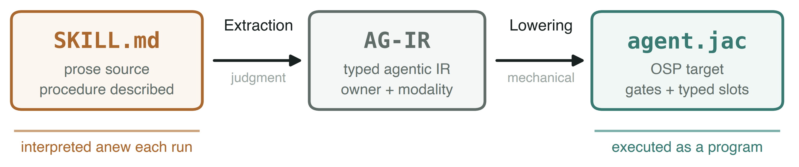
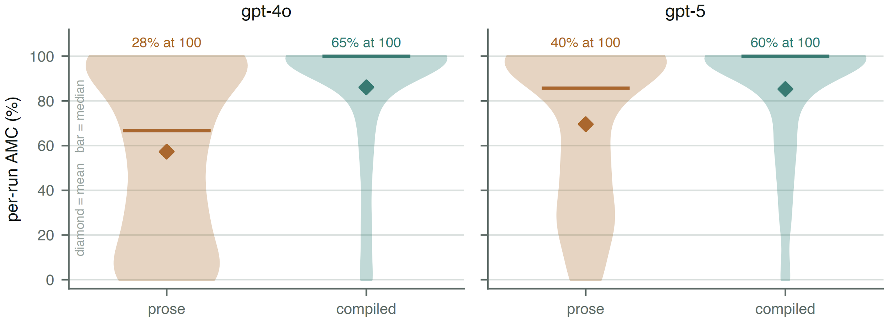

AI agents have become remarkably capable. They can write code, analyze documents, call APIs, search repositories, operate tools, and complete tasks that require several stages of reasoning.

However, there is still a major difference between **completing a task once** and **following the same procedure reliably every time**.

Consider a skill that tells an agent to run the complete test suite, inspect the output and exit code, confirm that no tests failed, and only then report that the task is complete. A model can correctly interpret every instruction, yet still report that the tests passed without actually running the test suite.

The issue is not necessarily that the model misunderstood the task. The issue is that **the procedure exists only as text inside the model's context**.

<div class="post-banner-wrap">
<a class="post-banner" href="https://sigilagent.com" aria-label="SIGIL, the skill compiler: don't prompt the skill, compile it — sigilagent.com">
<div class="pb-copy">
<div class="pb-logo"><svg viewBox="0 0 32 32" aria-hidden="true"><g fill="none" stroke="#a78bfa" stroke-width="1.6"><polygon points="16,3 28,10 28,22 16,29 4,22 4,10"/><path d="M16 3 L16 16 M28 10 L16 16 M28 22 L16 16 M16 29 L16 16 M4 22 L16 16 M4 10 L16 16"/></g><circle cx="16" cy="16" r="2.6" fill="#22d3ee"/></svg>SIGIL</div>
<div class="pb-title">Don't prompt the skill. <em>Compile</em> it.</div>
<div class="pb-pipeline">SKILL.md&nbsp;&nbsp;→&nbsp;&nbsp;AG-IR&nbsp;&nbsp;→&nbsp;&nbsp;agent.jac</div>
<span class="pb-pill">sigilagent.com&nbsp;→</span>
</div>
<div class="pb-mark"><svg viewBox="0 0 260 260" aria-hidden="true">
<defs><radialGradient id="pbcore" cx="50%" cy="50%" r="50%"><stop offset="0%" stop-color="#22d3ee"/><stop offset="100%" stop-color="#8b5cf6"/></radialGradient></defs>
<g class="ring" stroke="rgba(139,92,246,.35)" fill="none" stroke-width="1"><circle cx="130" cy="130" r="118" stroke-dasharray="3 7"/></g>
<g class="hex"><g stroke="#a78bfa" stroke-width="1.6" fill="none" opacity=".85"><polygon points="130,28 218,79 218,181 130,232 42,181 42,79"/><path d="M130 28 L130 130 M218 79 L130 130 M218 181 L130 130 M130 232 L130 130 M42 181 L130 130 M42 79 L130 130"/></g><g fill="#8b5cf6"><circle cx="130" cy="28" r="6"/><circle cx="218" cy="79" r="6"/><circle cx="218" cy="181" r="6"/><circle cx="130" cy="232" r="6"/><circle cx="42" cy="181" r="6"/><circle cx="42" cy="79" r="6"/></g></g>
<g class="tri"><path d="M130 66 L186 162 L74 162 Z" fill="none" stroke="#22d3ee" stroke-width="1.4" opacity=".7"/></g>
<circle cx="130" cy="130" r="11" fill="url(#pbcore)"/>
</svg></div>
</a>
</div>

## The rise of `SKILL.md`

Agent skills have emerged as a practical way to package reusable procedures. Instead of placing every instruction inside one large system prompt, developers can create a `SKILL.md` file that explains:

* When the skill should be used
* Which steps should be followed
* Which tools should be called
* What result should be produced

This is a useful authoring model. Markdown is **readable, editable, versionable, and easy to share**. It allows developers and domain experts to describe complex workflows without building a custom agent implementation for every task.

## Skills are still read, not executed

However, when a skill is invoked, its instructions are still loaded into the model's context. The model reads the procedure and decides how to carry it out. Nothing in the normal prompt-based execution model guarantees that every required step will happen.

This limitation is already visible in industry guidance. OpenAI's guidance for evaluating agent skills recommends checking not only the final output, but also whether the agent:

* Triggered the correct skill
* Ran the expected commands
* Followed the intended sequence

The examples include agents skipping installation commands, performing steps in the wrong order, or failing to invoke the skill reliably.

Anthropic makes a similar distinction between **instructions and enforcement**. Instructions placed in context can guide the model, but actions that must always be blocked or required generally need programmatic mechanisms such as hooks.

> ***The important distinction is simple: a skill can describe a procedure without guaranteeing that the procedure is executed.***

Our research found the same pattern across a wider set of tasks. Agents could read and explain their skills correctly while still:

* Skipping mandatory checks
* Describing tool calls they never made
* Collapsing a multi-stage procedure into a single output

This leads to a natural question: **what if we compiled `SKILL.md` into an agent harness, so that the required procedure became part of the program instead of remaining advice inside the prompt?**

## What compiling a skill actually means

Compiling a skill means turning the enforceable parts of `SKILL.md` into executable control flow. **Required tool calls become program operations, validation steps become gates, and ordering constraints become part of the workflow.**

Teams can already build these harnesses manually, but that means maintaining both the Markdown skill and a separate implementation. SIGIL automates this process by compiling the skill into a typed, runnable agent harness.

```text
SKILL.md
    ↓
Extract the procedure
    ↓
Validate the required steps
    ↓
./agent
```

The model still handles tasks that require judgment, such as writing, summarizing, and interpretation. Deterministic operations, such as running commands, checking exit codes, reading files, and writing required artifacts, are handled by code.

## How SIGIL compiles a skill

The compiler begins by extracting the requirements from the skill. Each extracted rule must point back to an exact passage in the original `SKILL.md`, which helps prevent the compiler from silently inventing requirements that were never present in the source.

SIGIL then converts the procedure into **AG-IR**, a typed intermediate representation for agent workflows. AG-IR records:

* The steps in the procedure
* The order in which they execute
* The data passed between them
* Which actions are mandatory or optional
* Whether each operation belongs to code or the model



> **From a prose skill to an executable agent harness.** SIGIL first extracts a grounded AG-IR graph from `SKILL.md`, where each step is assigned an owner and a modality. It then mechanically lowers that typed graph into a Jac agent harness with explicit control flow, gates, and typed model operations. Source: [SIGIL paper](https://arxiv.org/abs/2607.27309).

One of the central ideas is the **Owner Test**:

> **Is the result of this step determined by its inputs?**

When the answer is yes, **code should own the step**. Running a test command, reading an exit code, fetching a specified endpoint, or writing a file to a required location are all determined operations.

When a step requires interpretation, synthesis, taste, or open-ended reasoning, **the model should own it**. Writing a summary, evaluating a design, or choosing between several valid approaches are examples of model-owned work.

| Step                                    | Owner     |
| --------------------------------------- | --------- |
| Run a test command                      | **Code**  |
| Read the exit code                      | **Code**  |
| Fetch a specified API endpoint          | **Code**  |
| Summarize findings                      | **Model** |
| Evaluate whether a design is compelling | **Model** |

Once AG-IR has been created, SIGIL runs a set of compile gates. These gates check whether:

1. Every mandatory rule is represented
2. Required artifacts are actually produced
3. Approval stages genuinely block execution
4. Deterministic operations have been hidden inside large model prompts

If the graph does not faithfully represent the skill, **compilation fails with diagnostics** instead of silently producing an incomplete agent.

After the graph passes these checks, SIGIL mechanically lowers AG-IR into Jac. The final lowering stage does not ask another model to reinterpret the procedure. It translates the accepted graph into a runnable agent program.

## Why this matters

In a normal prompt-based skill, the model controls both the reasoning and the procedure. It decides what to do, whether a required step is necessary, and when the task is complete.

In a compiled skill, **the graph controls the procedure**. The model still performs the cognitive work inside individual steps, but it cannot skip structurally compiled nodes simply by deciding that they are unnecessary.

For example, if a skill requires tests to be run before completion, the generated harness can:

1. Execute the test command
2. Capture the exit code
3. Inspect the output
4. Allow the success path only when verification passes

The agent does not merely receive an instruction saying that verification is important. **Verification becomes part of the program.**

## Evaluation results

We evaluated SIGIL across **30 agent skills** covering document workflows, software processes, developer tools, and compliance-oriented tasks. Each run was measured using **Applicable-Mandate Compliance**, which calculates the percentage of required steps that applied to the task and were actually completed.

With GPT-4o, agents reading skills as prose completed **56 percent** of the applicable required steps on average. When the same skills were compiled with SIGIL, this increased to **86 percent**. With GPT-5, prose execution improved to **68 percent**, while SIGIL remained at **86 percent**.

| Execution method           | GPT-4o average | GPT-5 average |
| -------------------------- | -------------: | ------------: |
| `SKILL.md` read as prose   |            56% |           68% |
| **SIGIL compiled harness** |        **86%** |       **86%** |



> **Procedure compliance across prose and compiled skill execution.** The distributions show the percentage of applicable required steps completed in each run. Diamonds represent the average and horizontal bars represent the median. SIGIL achieved a median compliance of **100 percent with both GPT-4o and GPT-5**, meaning the typical compiled run completed every applicable required step. Source: [SIGIL paper](https://arxiv.org/abs/2607.27309).

The averages do not tell the entire story. For SIGIL, the median compliance score was **100 percent with both GPT-4o and GPT-5**. In other words, the typical compiled run completed every required step that applied to it. Prose execution, in comparison, was spread much more widely across the compliance range.

Looking only at runs that completed the entire applicable procedure:

* The prose agent succeeded in **28 percent** of runs
* The compiled harness succeeded in **65 percent** of runs
* This represents a **2.3 times increase** in complete procedure execution
* At the median, compiled execution used **0.58 times the tokens** of prose execution

The important result is not simply that SIGIL increased the average score. **Compilation changed the shape of the results.** With prose, procedure execution varied widely from run to run. With SIGIL, full execution became the common case because the graph, rather than the model, carried the procedure.

The complete evaluation and methodology are available in the [SIGIL paper](https://arxiv.org/abs/2607.27309).

## Try SIGIL

Install SIGIL on macOS or Linux:

```bash
curl -fsSL https://github.com/sigilagent/sigil/releases/latest/download/install.sh | bash
```

Compile an existing skill:

```bash
sigil compile ./SKILL.md
```

You can also export the compiled skill as a standalone Jac agent:

```bash
sigil compile ./SKILL.md -e agent.jac
```

Then run it directly:

```bash
./agent.jac "extract the tables from report.pdf"
```

## Use your existing Claude subscription

If you already use Claude Code, SIGIL can send its model calls through the authenticated Claude CLI. This allows you to compile skills **without configuring a separate Anthropic API key**.

```bash
sigil --claude compile ./SKILL.md
```

You can also compile and export a standalone agent:

```bash
sigil --claude compile ./SKILL.md -e agent.jac
```

Compiled skills can be exposed back to Claude Code as MCP tools:

```bash
claude mcp add sigil -- sigil mcp-serve
```

In this setup:

* **Claude Code decides when a skill is appropriate**
* **The compiled SIGIL harness controls how the procedure is executed**

## Skills should be more than instructions

`SKILL.md` is a useful authoring format because it gives developers a simple way to describe procedures and package reusable agent capabilities.

But **reading a procedure is not the same as executing it**.

A required test should run because the program runs it. A required artifact should exist because a node writes it. A required approval should block execution until it is received.

SIGIL keeps Markdown as the human-readable source, then compiles its enforceable requirements into a typed agent harness.

**Agent skills should not only be read. They should be compiled.**

## Links and resources

- **SIGIL website:** [sigilagent.com](https://sigilagent.com)
- **SIGIL documentation:** [sigilagent.com/reference](https://sigilagent.com/reference/)
- **Skill compilation reference:** [How SIGIL compiles `SKILL.md`](https://sigilagent.com/reference/skill-compilation.html)
- **SIGIL GitHub repository:** [github.com/sigilagent/sigil](https://github.com/sigilagent/sigil)
- **SIGIL research paper:** [SIGIL: Compiling Agent Skills into Typed Harnesses](https://arxiv.org/abs/2607.27309)
- **Jac language website and documentation:** [jaclang.org](https://jaclang.org)
- **Jac GitHub repository:** [github.com/jaseci-labs/jac](https://github.com/jaseci-labs/jac)
- **Jaseci:** [jaseci.org](https://www.jaseci.org)
