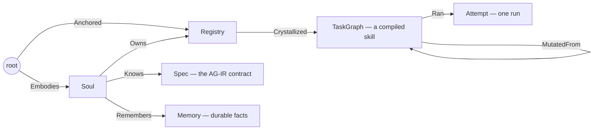

# Overview

Sigil is a **skill compiler**. You write a skill as plain markdown; Sigil
compiles it into a typed agent harness — a program the model runs *inside*, so
every step, rule, and check in the skill is enforced by structure rather than
hoped for in a prompt. See [skill-compilation](skill-compilation.md) for the
pipeline.

Everything the compiler produces and needs lives on one persistent
object-spatial graph — compiled skills, configuration, memory — there are no
config files on disk.

## The two-tier economics

A **frontier model** is paid once, at compile time, to author the typed
procedure (the AG-IR) that the compiler lowers and gate-checks. From then on a
**cheap, small, even fully-local model** executes the compiled harness — the
structure a weak model would skip is no longer skippable.

## How a request flows

- **`sigil compile ./SKILL.md [-e out.jac]`** — the explicit path: compile a
  skill onto the graph; `-e` also ejects one self-contained runnable program.
- **`sigil solve "<task>"`** — the compiler applied at runtime: route the task
  against the compiled-skill library (**HIT** — run it on the cheap model),
  compile a new skill for a new class of task (**MISS**), or recompile an
  existing one to cover a near-match (**PARTIAL**). See
  [memory-and-skills](memory-and-skills.md).
- **Chat mode** (`sigil chat`) — a conversational agent over the same graph:
  files, shell, web, cron, memory, skills, MCP, channels, parallel sub-agents.
  See [chat-and-tools](chat-and-tools.md).

## The graph (the compiler's persistent memory)

The `Soul` node holds all configuration — persona, model tiers, workspace, sandbox mode,
channels, policies. `awaken()` rebinds the agent's cognition from the graph on every run,
so a `configure` change takes effect on the next turn with no restart.

## Interfaces

- `sigil chat` — the conversational REPL (markdown, live tool trace, inline approvals).
- `sigil <command>` — one-shot CLI (`solve`, `soul`, `configure`, `cron`, `channel`,
  `docs`, `models`, `teach`, `recall`, …). Run `sigil` with no args for the full list.
- `sigil serve` (= `jac start observatory.jac`) — the full-stack server: REST API + the Observatory web UI
  (live agent-graph + token observability), plus the `api_inbound` webhook for channels.
