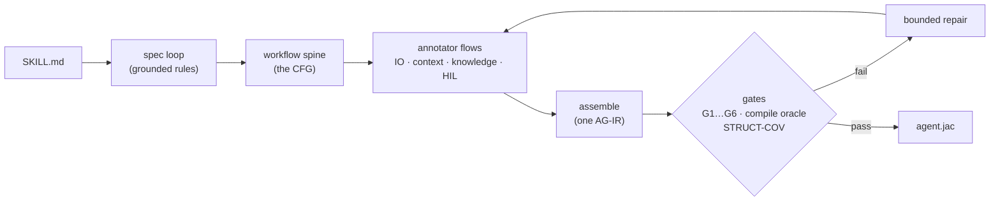

# Skill compilation

The core of Sigil: turning a plain-markdown `SKILL.md` into a typed, runnable
agent harness. The compiler has two halves (`src/compiler/`):

- **The AI half** (`ai/`) — the LIFT front-end. Frontier-model judgment under a
  faithfulness constraint: extract what the skill *mandates*, design the graph
  that realizes it, never add, drop, or soften a rule.
- **The mechanical half** (`mechanical/`) — the LOWER back-end. Deterministic,
  judgment-free transpilation of the typed contract (AG-IR) into a runnable
  OSP module. If lowering ever needs a guess, the front-end is at fault.

## The pipeline



- **Spec loop** — the anchor. The model proposes rules; **code disposes**: every
  rule must quote the skill *verbatim* (hallucinated rules are dropped
  mechanically), three coverage critics hunt for dropped obligations, a deontic
  audit catches modality drift ("may" hardened into "must"). Loops until sound,
  complete, and drift-free.
- **Workflow spine** — types every rule into the AG-IR alphabet (typed model
  slots, code steps, routes, human gates), owner-tests each one (*is the output
  a function of the inputs? then code owns it*), and wires the control-flow
  graph. A validator enforces: every mandatory rule realized by a node, adaptive
  tool-use never shredded into fixed calls, prohibitions become constraints —
  never paths.
- **Annotator flows** (parallel) — dataflow (carries), knowledge scoping (which
  node sees which reference text), the snippet sort (runnable tool bodies vs
  grounding knowledge), and human-gate points.
- **Assemble** — joins the views on the rule-id spine and persists `traces_to`
  onto every node: full provenance, skill sentence → rule → node → compiled
  ability → runtime trace.

## The gates

Compilation fails loudly, with rule-level diagnostics, when:

| Gate | Rejects |
|---|---|
| G1 standalone | a tool or knowledge entry that *points* at content instead of embodying it ("see FORMS.md") |
| G3 artifact boundary | a mandated deliverable that nothing actually writes to disk |
| G4 compile oracle | an AG-IR that doesn't lower to a clean-compiling module (real `jac check`, every time) |
| G5 STRUCT-COV | a mandate folded into some other slot's interior (*monolithic* — model-dependent, same risk as prose) |
| G6 human gates | a route that consumes human feedback but leaves the decision to model judgment |

Failures route back through a bounded repair pass — each flow fixes its own
view — and an unfixable lift returns its issues honestly; nothing unfaithful is
persisted.

## Using it

```bash
sigil compile ./SKILL.md                 # compile → skill set on the graph
sigil compile ./SKILL.md -e agent.jac    # …and eject ONE self-contained runnable
./agent.jac "extract the tables"         # runs on any model: SIGIL_MODEL=…
sigil register-skill ./x.agir agir       # hand-authored AG-IR, no model call
sigil register-skill ./y.jac osp         # drop in a precompiled module
sigil replay agent.jac obs.jsonl "task"  # re-run a recorded run's cognition — free
sigil gate ./x.agir                      # run G4, the compile oracle, on its own
```

## Watching the compile

`sigil compile` is verbose by default: each stage prints as it opens, and — in claude
mode, where the provider can stream — the model's output appears under it as it is
generated, dimmed and indented, thinking included.

```
  ◐ spec loop

      Let me carefully extract the rules from the skill text…
      1. Quote must be VERBATIM from the skill
      2. Read modality from deontic vocabulary only…

  ✔ spec loop        14 rules · 3 rounds · ok  41.2s
  ◐ workflow spine
```

A compile is dozens of model calls over many minutes. Before this it showed a stage
label, a spinner, and then a verdict — hiding the only thing worth watching, since the
words being written *are* the artifact being built.

`--quiet` (or `SIGIL_VERBOSE=0`, or `sigil configure verbose off`) falls back to the
compact view, which rewrites one line in place per stage. Verbose mode deliberately does
not do that: rewriting the current line only works when nothing else is writing to it.

An opt-in alternate front-end swaps the staged LIFT authoring for a Claude Code
session that writes the AG-IR against the compile oracle, keeping the grounded
spec loop and the gate battery: `sigil --claude compile ./SKILL.md --agent`. See
[claude-code](claude-code.md) for what that trades away.

## Running a compiled artifact

An ejected artifact is a **terminal app, not a script**. Run it in a terminal
and you get a live TUI: a banner, the walker's node path rendering as it
executes (with per-node timings), human gates asked **inline** (`? question`
→ type your answer — the compiled skill's clarify loops become a real
conversation), and a styled outcome with the report and every artifact the run
created. No task argument? It prompts for one. Zero extra dependencies — pure
ANSI, part of the compiled runtime. Piped, captured, or in CI the same run is
byte-identical to the old plain output (`AGIR_TUI=0/1` overrides detection).

Compiled runs are honest by construction: a walker that never reaches its
terminal reports `INCOMPLETE` (never a silent success), runaway loops abort at
`AGIR_STEP_BUDGET` (default 256) naming the node, and human gates ask a real
channel when one is attached (`HIL_QA_FILE`; an honest sentinel in batch).
Every run leaves a node-path trace (`AGIR_PROGRESS`) and, under the runtime, a
per-call token/cost log — so any step traces back to the exact sentence in the
skill that mandated it.
