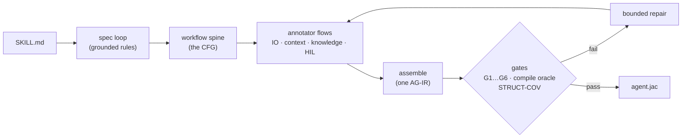

# Skill compilation

The core of Sigil: turning a plain-markdown `SKILL.md` into a typed, runnable
agent harness. The compiler has two halves (`src/compiler/`):

- **The AI half** (`ai/`) — the LIFT front-end. Frontier-model judgment under a
  faithfulness constraint: extract what the skill *mandates*, design the graph
  that realizes it, never add, drop, or soften a rule.
- **The mechanical half** (`mechanical/`) — the LOWER back-end. Deterministic,
  judgment-free transpilation of the typed contract (AG-IR) into a runnable
  OSP module. If lowering ever needs a guess, the front-end is at fault.

## The pipeline



- **Spec loop** — the anchor. The model proposes rules; code disposes: every
  rule must quote the skill *verbatim* (hallucinated rules are dropped
  mechanically), three coverage critics hunt for dropped obligations, a deontic
  audit catches modality drift ("may" hardened into "must"). Loops until sound,
  complete, and drift-free.
- **Workflow spine** — types every rule into the AG-IR alphabet (typed model
  slots, code steps, routes, human gates), owner-tests each one (*is the output
  a function of the inputs? then code owns it*), and wires the control-flow
  graph. A validator enforces: every mandatory rule realized by a node, adaptive
  tool-use never shredded into fixed calls, prohibitions become constraints —
  never paths.
- **Annotator flows** (parallel) — dataflow (carries), knowledge scoping (which
  node sees which reference text), the snippet sort (runnable tool bodies vs
  grounding knowledge), and human-gate points.
- **Assemble** — joins the views on the rule-id spine and persists `traces_to`
  onto every node: full provenance, skill sentence → rule → node → compiled
  ability → runtime trace.

## The gates

Each gate rejects a specific way an AG-IR can be unfaithful, with rule-level
diagnostics:

| Gate | Rejects |
|---|---|
| G1 standalone | a tool or knowledge entry that *points* at content instead of embodying it ("see FORMS.md") |
| G3 artifact boundary | a mandated deliverable that nothing actually writes to disk |
| G4 compile oracle | an AG-IR that doesn't lower to a clean-compiling module (real `jac check`, every time) |
| G5 STRUCT-COV | a mandate folded into some other slot's interior (*monolithic* — model-dependent, same risk as prose) |
| G6 human gates | a route that consumes human feedback but leaves the decision to model judgment |

The gates diagnose rather than veto. What a failure triggers, in order:
mechanical autofixes (each re-gated through G4), then scoped model repair with
each flow fixing its own view, then faithful degradation. Whatever still remains
rides the result as typed `{gate, severity, message}` findings — errors are
runtime crashes or violated mandates, warnings are faithfulness audits. A compile
fails only when no runnable module exists at all, and it fails with the gate
diagnostics attached rather than a bare error.

`--strict` (or `SIGIL_STRICT=1`) restores fail-on-any-finding, which is what you
want in CI.

## Linting a skill first

An interactive compile offers to lint before it compiles. The lint reuses the
spec loop's extraction, so the obligations it surfaces are the same ones the
compiler is about to type: the ones whose modal force is underspecified, and the
ones that contradict another rule.

For each finding you answer once — do, maybe, or don't — and that answer both
settles the obligation for this compile and rewrites the sentence in your
`SKILL.md` so the ambiguity is gone for good. The rewrite is mechanically
guarded: the replaced span is verbatim and at most one sentence, the new text
must clear a length floor, keep every backtick token, carry a modal marker, and
survive a punctuation check. Accepting everything is safe by construction.

```bash
sigil lint ./SKILL.md            # findings only
sigil lint ./SKILL.md --fix      # findings, and apply the accepted rewrites
```

## Underspecified obligations

Plenty of skills state an obligation without ever saying how binding it is —
`Run the validator before shipping.` is a sentence with no *must*, no *may*, no
*never*. The extractor has to type it anyway, and whatever it picks is a guess.

Often, though, the skill *did* say — one scope out. Markdown puts obligations
under headings and inside lists, and either can carry a force the item itself
omits:

```markdown
## Required steps           <- the heading mandates its whole section
Run the validator.          <- states no marker, but is not a maybe

You may optionally:         <- the intro governs the list under it
- Bump the minor version.   <- states no marker, but is not a mandate
```

The spec loop reads that. Which heading encloses a line and which intro opens a
list are facts about the markdown, and the force is then read with the same
deontic marker tables the rest of the loop uses — the identical move that
already demotes fenced example code to a *maybe*. An obligation whose container
states a force inherits it, the nearest scope wins, and a span that states a
force of its own is never overridden by what encloses it.

**No model is involved.** That is a requirement rather than an optimization: the
spec is the anchor every later stage is audited against, so a spec that varied
with the model doing the compiling would not be an anchor. Extraction can afford
a model because `ground_rules` mechanically drops any span not verbatim in the
skill, so different models converge on the same document text. A modality
verdict has no such check behind it — two models can read one heading oppositely
and both pass every gate. Code has to own this decision or nothing does.

It is deliberately narrow. Inheritance fires only when the governing line states
exactly one force, and heading words are matched against explicit tables, not
interpreted — `## Recipes` and `## Common tasks` settle nothing.

Structural bindings are reported with the heading or intro they came from, so
you can see what the document decided for you. They are *not* warnings: the
skill did state the force, so failing `--strict` over it would punish a
well-organized skill.

### The adjudicator

Whatever structure cannot settle is the **residue** — obligations the author
genuinely left open. Three tiers can answer those:

| Tier | Who answers |
|---|---|
| `--clarify` | you do, inline, one at a time. Nothing outranks it |
| *(default)* | **the adjudicator**, standing in for you, from the skill's own text |
| `--no-adjudicate` | nobody — assumed a *maybe*, no model call at all |

The adjudicator gets one batched call over the whole residue. Each item arrives
with a deterministic evidence packet — its heading chain, its neighbouring
lines, and which of those state a force of their own — all read off the
markdown by code before the model sees anything.

Every answer must cite a span that is **verbatim in the skill and outside the
obligation's own sentence** (that sentence is what got flagged, so quoting it
back settles nothing). Answers failing either check are dropped, along with
unrecognized verdicts and any attempt to re-modalize a rule that was never
flagged. Dropped answers fall back to *maybe*, and the rejections are reported
rather than swallowed.

**On model dependence, plainly:** this tier is model-dependent and the grounding
check does not remove that. Two models can read one heading differently and both
cite it verbatim — grounding bounds *where* an answer may come from, never
*which* answer it is. That is why the deterministic pass runs first and keeps as
much as possible out of here, why every decision is reported with the model that
made it and the span it came from, and why `--no-adjudicate` exists. Use it when
you need a compile with no model-dependent decision in it.

What the adjudicator may never do is decide silently. Every answer lands in the
compile's warnings, so `--strict` still fails on a skill that left the question
open, no matter which tier resolved it.

## Using it

```bash
sigil compile ./SKILL.md                 # compile → skill set on the graph
sigil compile ./SKILL.md -e agent.jac    # …and eject ONE self-contained runnable
sigil compile ./SKILL.md --clarify       # answer underspecified obligations yourself
sigil compile ./SKILL.md --no-adjudicate # assume 'maybe' instead; no model-dependent call
./agent.jac "extract the tables"         # runs on any model: SIGIL_MODEL=…
sigil register-skill ./SKILL.md          # same gated compile as `compile`
sigil register-skill ./x.agir agir       # hand-authored AG-IR, no model call
sigil register-skill ./y.jac osp         # drop in a precompiled module
sigil gate ./x.agir                      # run G4, the compile oracle, on its own
sigil relearn <signature>                # recompile a stored skill at a bumped version
```

There is one compile pathway: `compile`, `register-skill <SKILL.md>` and the
`solve` loop's recompiles all run the same gated engine. Skills persist their
source, so `relearn` re-enters the compiler with the original skill text.

## The standard tool library

A code-owned node lowers through a tool, and a tool needs a body. Before, the author had
to hand-write Python for every mundane step — read this file, grep that directory, run
that script — and when it didn't, the node lowered to a marker comment and the assemble
gate killed the compile. The work was never hard; it was just never offered.

These always exist and can be bound by name:

| Tool | Surface | |
|---|---|---|
| `read_file(path)` | SENSE | read a text file |
| `list_dir(path)` | SENSE | one directory level |
| `glob_files(pattern, path)` | SENSE | find files, recursively |
| `grep(pattern, path)` | SENSE | regex over file contents |
| `write_file(path, content)` | ACT | write text, creating parents |
| `run_command(command)` | ACT | shell, exit code + output |
| `http_get(url)` | SENSE | fetch a public URL |

The names match the vocabulary a skill written for any agent runtime already uses —
Anthropic's own skills declare `allowed-tools: Bash Read Grep Glob` — so a lift maps onto
them without translation. Binding one takes no body:

```yaml
tools:
  read_file:
    surface: SENSE
    serves: [n4_read_primer]
```

The library's canonical signature wins over whatever the author wrote, so the inlined
body's parameter names always match the wrapper generated around them. An explicit
`body:` or `command:` still takes precedence — the library is a floor, not a ceiling.

**Inlined, not imported.** Each body is self-contained stdlib Python, spliced into the
generated module at lower time. A compiled skill runs in a subprocess where Sigil is not
importable, and `compile -e` ejects a program that must run with no repo at all — so a
library that had to be imported at run time would be no library at all.

## Watching the compile

`sigil compile` is verbose by default: each stage prints as it opens, and — in claude
mode, where the provider can stream — the model's output appears under it as it is
generated, dimmed and indented, thinking included.

```
  ◐ spec loop

      Let me carefully extract the rules from the skill text…
      1. Quote must be VERBATIM from the skill
      2. Read modality from deontic vocabulary only…

  ✔ spec loop        14 rules · 3 rounds · ok  41.2s
  ◐ workflow spine
```

A compile is dozens of model calls over many minutes. Before this it showed a stage
label, a spinner, and then a verdict — hiding the only thing worth watching, since the
words being written *are* the artifact being built.

`--quiet` (or `SIGIL_VERBOSE=0`, or `sigil configure verbose off`) falls back to the
compact view, which rewrites one line in place per stage. Verbose mode deliberately does
not do that: rewriting the current line only works when nothing else is writing to it.

An opt-in alternate front-end swaps the staged LIFT authoring for a Claude Code
session that writes the AG-IR against the compile oracle, keeping the grounded
spec loop and the gate battery: `sigil --claude compile ./SKILL.md --agent`. See
[claude-code](claude-code.md) for what that trades away.

## Running a compiled artifact

An ejected artifact is a terminal app, not a script. Run it in a terminal
and you get a live TUI: a banner, the walker's node path rendering as it
executes (with per-node timings), human gates asked inline (`? question`
→ type your answer — the compiled skill's clarify loops become a real
conversation), and a styled outcome with the report and every artifact the run
created. No task argument? It prompts for one. Zero extra dependencies — pure
ANSI, part of the compiled runtime. Piped, captured, or in CI the same run is
byte-identical to the old plain output (`AGIR_TUI=0/1` overrides detection).

Compiled runs are honest by construction: a walker that never reaches its
terminal reports `INCOMPLETE` (never a silent success), runaway loops abort at
`AGIR_STEP_BUDGET` (default 256) naming the node, and human gates ask a real
channel when one is attached (`HIL_QA_FILE`; an honest sentinel in batch).
Every run leaves a node-path trace (`AGIR_PROGRESS`) and, under the runtime, a
per-call token/cost log — so any step traces back to the exact sentence in the
skill that mandated it.
